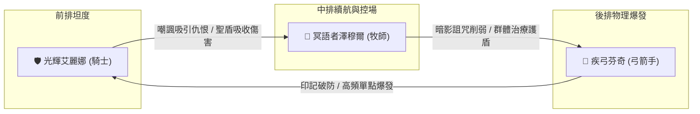

# ⚔️ 玩家當前隊伍現況與 2800 戰力突破指南

> 本文檔針對玩家目前陣容（**光輝艾麗娜**、**冥語者澤穆爾**、**疾弓芬奇**）以及當前處境進行深度診斷與戰力突破規劃。

---

## 📊 一、當前處境與資源限制條件

| 項目 | 當前狀態 | 影響與限制 |
| :--- | :--- | :--- |
| **主線進度目標** | 卡在【遺忘荒地 (Lv. 61~70)】門前 | 系統強制要求總戰力達 **`2800`** 才能解鎖挑戰 |
| **英雄等級** | **已達上限滿等** | 無法再透過經驗藥水或打怪升級增加基礎屬性 |
| **英雄星級** | **暫不升星 (0~1星)** | 正全力儲蓄 **12,800 英雄幣** 準備直接購買神話/超越 6.0 頂級英雄 |
| **城鎮血之祭壇** | **已獻祭血量** | 血之祭壇僅能獻祭血液，且遊戲底層不直接提供隊伍面板戰力數值 |

---

## 🛡️ 二、當前主力「鐵三角」陣容深度分析



### 1. 🛡️ 【前排核心】光輝艾麗娜 (騎士 / 聖騎士)
* **職業定位**：重甲前排、仇恨嘲諷、聖光守護
* **底層屬性專精**：
  - 神聖傷害加深 +10% / 神聖抗性 +10%
  - 生命值基礎 +10% / 物理抗性 +10%
  - **每級物防成長：+5.0**（全遊戲物理坦度成長第一）
* **裝備偏好**：長槍 (`spear`)、**重盾 (`shield`)**、重甲套裝 (`heavy_armor`)
* **核心戰術價值**：
  - 承擔遺忘荒地獸人突襲者的暴擊傷害，為中後排創造安全輸出環境。

---

### 2. 🔮 【中排核心】冥語者澤穆爾 (牧師 / 暗影神官)
* **職業定位**：暗影詛咒、虛空牽制、團隊血線續航
* **底層屬性專精**：
  - **治療效果提升 +10%**
  - 神聖/暗影傷害加深 +20% / 抗性 +10%
  - 每級魔防成長：+5.0
* **裝備偏好**：權杖 (`scepter`)、魔導書 (`book`)、輕甲法袍 (`light_armor`)
* **核心戰術價值**：
  - 施加痛苦折磨詛咒與暗影侵蝕，大幅削弱敵方防禦與抗性，並提供全隊受癒維穩。

---

### 3. 🏹 【後排核心】疾弓芬奇 (弓箭手 / 遊俠)
* **職業定位**：後排單體秒殺、多目標流血、印記削防
* **底層屬性專精**：
  - **暴擊率 +10%** / **物理傷害加深 +20%** / 物理抗性 +10%
  - 雙端傷害每級 +1.0 / 物防 +3.0 / 魔防 +3.0
* **裝備偏好**：長弓 (`bow`)、箭袋 (`quiver`)、中甲 (`medium_armor`)
* **核心戰術價值**：
  - 利用雙重射擊與印記射擊，快速在 1~2 回合內點殺敵方後排薩滿與先知。

---

## 🚀 三、零升級、零升星下突破 2800 戰力的精確路徑

在不消耗英雄幣、不升星、英雄已滿等的情況下，**「裝備全槽位補齊」與「鐵匠鋪高階鍛造」是唯一且絕對能跨越 2800 戰力的手段**：

### 1. 補齊全部 10 大裝備槽位（戰力提升：+600 ~ +900）
目前許多玩家戰力不足，常是因為飾品、副手或腰帶槽位處於空白或佩戴低階白裝：
* **主武器 + 副手**：
  - **艾麗娜**：務必裝備 **紫色/金色重盾 (`shield`)**（盾牌在戰力演算法中加權極高，提供大量物防與格擋評分）。
  - **芬奇**：高階紫弓 + 暴擊箭袋。
  - **澤穆爾**：高法強權杖 + 魔導書。
* **防具 5 件套**：頭盔、胸甲、手套、腰帶、靴子全部穿齊對應甲種（騎士穿重甲、遊俠穿中甲、牧師穿輕甲）。
* **飾品 3 件套**：戒指 x2、項鍊、聖物（全部填滿，不要留空）。

---

### 2. 善用 50 倍速極速刷取材料與鐵匠鋪合成
利用我們已實裝的 `set_battle_settings.py --speed 50`：
1. **前往主線第 5~6 關【冰凍峽谷 / 史萊姆地下城】** 自動掛機刷 20~30 場（約 2~3 分鐘）。
2. 收集大量 **精鐵錠 (`ingot_iron`)**、**黃金錠 (`ingot_gold`)** 與 **寶石材料**。
3. 到城鎮 **鐵匠鋪 (Blacksmith)** 將三位英雄身上的裝備全面替換為 **4 階史詩 (紫) 或 5 階傳說 (橘) 裝備**。

---

### 3. 戰力試算與成果預期

```text
【當前基礎戰力】 ──► 約 2100 ~ 2300 (滿等 + 散裝)
【全套紫/橘裝備】 ──► + 400 ~ 500 戰力
【填滿重盾與飾品】 ──► + 250 ~ 350 戰力
────────────────────────────────────────
【最終面板戰力】 ──► 2850 ~ 3050 (順利突破 2800 門檻！)
```

---

## 🎯 四、12,800 英雄幣存滿後的終極陣容規劃

當您透過掛機順利存滿 12,800 英雄幣後，建議優先在酒館兌換以下頂級超越 6.0 英雄，直接完成陣容終極質變：

1. **首選：`hero_archer_drugor` (遊俠 德魯戈)** ➔ 替換疾弓芬奇，具備爆血處決與無限血怒被動。
