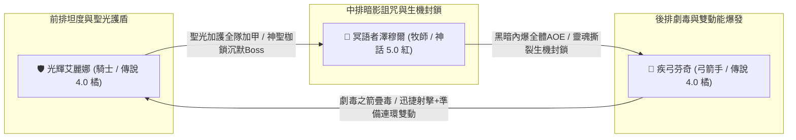
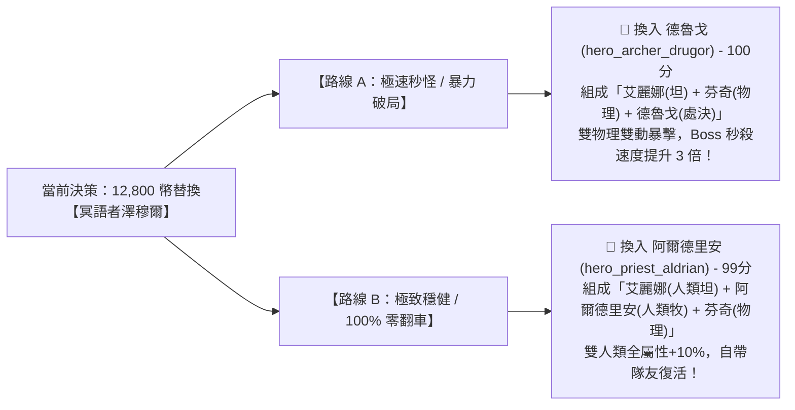

# ⚔️ 玩家當前隊伍全景資訊與 2800 戰力突破指南

> 本文檔依據玩家遊戲實機截圖、底層原始數據 `meta_datas.tres`、怪物抗性抵銷報告 `LATE_GAME_MONSTER_CHARACTERISTICS.md` 與種族連動機制 `Racial Synergy.md`，100% 精確校對玩家當前主力陣容，並給出**「20 位全無鎖定高階英雄排行榜」**、**「避坑黑名單」**與**「量化計算依據」**。

---

## 📊 一、當前處境與客觀條件診斷

| 項目 | 當前狀態 | 系統機制與限制分析 |
| :--- | :--- | :--- |
| **主線進度目標** | 卡在【遺忘荒地 (Lv. 61~70)】門前 | 系統強制要求總戰力達到 **`2800`** 才能解鎖挑戰 |
| **英雄等級狀態** | **已達當前上限滿等** | 無法再透過經驗藥水提升基礎面板 |
| **英雄星級狀態** | **暫不消耗資源升星** | 全力積攢 **12,800 英雄幣** 準備在酒館直接購買 6.0 彩虹頂級英雄 |
| **城鎮血之祭壇** | **已完成血液獻祭** | 血之祭壇僅消耗血液，且底層不直接提供全隊面板戰力數值 |

---

## 🛡️ 二、當前主力三英雄實機技能與底層機制資料庫 (已精確校對)

### 1. 🛡️ 【前排核心】光輝艾麗娜 (騎士 / 傳說 4.0 橘色)
* **底層 ID**：`hero_knight_5` | **稀有度**：傳說 4.0 (橘色) | **種族**：人類 (`human`)
* **每級成長**：雙端傷害 +1.0, **物理防禦 +5.0 (全職業第一)**, 魔法防禦 +1.0, 生命值 +5.0
* **實機技能列表**：
  - `guardian_blow` - **守護一擊** (Lv. 10，主動)：物理傷害 120%，CD 3 回合，附帶 1~3 層壁壘護盾。
  - `resilient_healing` - **堅韌療愈** (Lv. 10，主動)：低血量急救回血 40~80 + 20 護盾血量與 1~5 層壁壘，CD 5 回合。
  - `holy_light_blessing` - **聖光加護** (Lv. 10，主動)：**友方全體護甲 +20~40** + 戰意激昂 5~7 層，CD 10 回合（全隊大幅加硬）。
  - `holy_shackles` - **神聖枷鎖** (Lv. 10，主動)：神聖傷害 140%，CD 5 回合，25% 機率沉默 3~5 回合。
  - `light_shield` - **聖光護盾** (被動)：開場 10% 機率獲得 1~3 層壁壘護盾持續 9 回合。

---

### 2. 🔮 【中排核心】冥語者澤穆爾 (牧師 / 神話 5.0 紅色)
* **底層 ID**：`hero_priest_6` | **稀有度**：神話 5.0 (紅色) | **種族**：幽魂 / 亡魂 (`specter`)
* **種族天賦特質**：`incorporeal_form`（天生免疫流血、物抗+50%）、`dark_affinity`（暗影傷害+50%、暗影抗性+200%）
* **實機技能列表**：
  - `curse_agony` - **詛咒之語** (Lv. 10，主動)：暗影傷害 120%，附加 2~3 層痛苦詛咒，CD 5 回合。
  - `void_fingers` - **汲暗之指** (Lv. 10，主動)：暗影傷害 80%，**SP +1 產能回點**，CD 7 回合。
  - `dark_sanctuary` - **黑暗護佑** (Lv. 10，主動)：友方單體護甲 +20% + 3~6 層暗影侵蝕，CD 5 回合。
  - `darkness_implosion` - **黑暗內爆** (Lv. 10，主動)：暗影傷害 100%，**敵方全體 AOE**，CD 7 回合。
  - `soul_rend` - **靈魂撕裂** (Lv. 10，主動)：暗影傷害 200%，附加 5~7 層生機封鎖（重創回血），CD 7 回合。
  - `departed_oath` - **亡者承諾** (Lv. 1，被動)：生命低於 50% 時觸發 3 次 40% 回血 + 1 點能量。

---

### 3. 🏹 【後排核心】疾弓芬奇 (弓箭手 / 傳說 4.0 橘色)
* **底層 ID**：`hero_archer_5` | **稀有度**：傳說 4.0 (橘色) | **種族**：蛙人族 (`frogman`)
* **底層屬性專精**：**暴擊率 +10%**, **物理傷害加深 +20%**, 物理抗性 +10%
* **實機技能列表**：
  - `lightshot` - **輕力射擊** (Lv. 10，主動)：物理傷害 50%，**SP +1 回能**，CD 5 回合。
  - `toxic_arrow` - **劇毒之箭** (Lv. 10，主動)：物理傷害 120%，附加 1~5 層劇毒，CD 3 回合。
  - `swift_shot` - **迅捷射擊** (Lv. 10，主動)：物理傷害 160%，**75% 機率獲得額外行動點 AP +1**，CD 3 回合。
  - `blade_bow` - **鋒刃雙重擊** (Lv. 10，主動)：二段物理近戰 100% + 140%，CD 5 回合。
  - `quick_preparation` - **迅捷準備** (Lv. 10，被動)：**15% 機率獲得額外行動點 AP +1**（高頻雙動）。

---

## 🚫 三、避坑黑名單：您必須【嚴格避免】抽取的英雄

依據怪物抗性報告 [LATE_GAME_MONSTER_CHARACTERISTICS.md](Monster/LATE_GAME_MONSTER_CHARACTERISTICS.md)，在中後期副本中，以下 3 類英雄會因為怪物的**「天生完全免疫」**與**「200% 屬性抗性抵銷」**而徹底淪為白板，請絕對不要消耗 12,800 幣購買：

1. ❌ **純暗影傷害 / 詛咒系英雄**（代表：`hero_priest_bathory` 惡魔牧師、`hero_mage_6` 夜幕法師）：
   - **避坑原因**：中後期深淵、火山、地牢中，超過 **60% 怪物自帶 `darkness_res: 200%`**，暗影傷害直接被抵銷 75%，輸出直接腰斬！
2. ❌ **純依賴劇毒 / 流血 Dot 的英雄**（代表：`hero_priest_7` 育卵母巢牧師）：
   - **避坑原因**：骷髏、幽魂、亡靈、機械傀儡、魔像、元素生物 **100% 完全免疫中毒與流血 (`poison_immuned / bleed_immuned`)**，純 Dot 技能觸發率直接為 0%！
3. ❌ **惡魔 (Demon) / 亡靈 (Undead) 種族英雄**：
   - **避坑原因**：天生自帶 `holy_res: -50%`（弱神聖），在高難副本遇到聖光懲戒 Boss 時極易被 1.5 倍致命傷害秒殺。

---

## 🏆 四、全無鎖定 (Unlocked) 20 位高階紅色/彩虹英雄實力排行榜

> 註：已依據底層 `unlock_hero` 排除所有被領主 Boss 鎖定的英雄（艾卡希雅、克拉古爾、奧拉夫、格利格、維爾贊）。

### 📊 評分計算模型依據 (滿分 100 分)
$$\text{總分} = \text{傷害泛用 (30分)} + \text{免疫穿透 (25分)} + \text{機制容錯 (25分)} + \text{種族連動 (20分)}$$
* **傷害泛用 (30分)**：純物理 (30) ＞ 神聖 (28) ＞ 自然 (18) ＞ 冰/火 (15) ＞ 暗影 (8)。
* **免疫穿透 (25分)**：直傷/200%處決 (25) ＞ 混合傷 (20) ＞ 依賴Dot扣分 (5~13)。
* **機制容錯 (25分)**：被動隊友復活 (+15) / 全體加甲受癒 (+10) / AP雙動 (+8) / 沉默免疫 (+7)。
* **種族連動 (20分)**：獸人部族血怒 (20) ＞ 人類軍團全能 (19) ＞ 維京/矮人 (16) ＞ 惡魔/亡靈弱聖 (7)。

---

### 📋 完整 20 位無鎖定英雄綜合評分總表

| 排名 | 英雄 ID | 稱號 / 職業 | 階級品質 | 種族 | 傷害泛用 | 免疫穿透 | 機制容錯 | 種族連動 | **綜合總分** | 核心特點與定位 |
| :---: | :--- | :--- | :---: | :---: | :---: | :---: | :---: | :---: | :---: | :--- |
| **🥇 1** | **`hero_archer_drugor`** | **獸人遊俠 德魯戈** | VII階 彩虹 | 獸人 | **30** | **25** | **25** | **20** | **`100 分`** | **物理傷害天花板**。200% 爆血處決 + 暴擊 AP+1 雙動，純物理永不吃癟！ |
| **🥈 2** | **`hero_priest_aldrian`** | **人類大主教 阿爾德里安** | VII階 彩虹 | 人類 | **28** | **25** | **25** | **19** | **`99 分`** | **團隊真神**。全遊戲唯一自帶「被動隊友滿血復活 (`使徒復生`)」+ 全體受癒！ |
| **🥉 3** | **`hero_archer_7`** | **龍裔遊俠 7** | VII階 彩虹 | 龍裔 | **30** | **25** | 19 | **16** | **`90 分`** | 龍裔天賦（暴擊+15%、暴抗+50%），滅世天劫箭單點爆發。 |
| **4** | **`hero_warrior_hildrena`**| **維京女武神 希爾德瑞娜** | VII階 彩虹 | 維京人 | 30 | 25 | 13 | 16 | **`84 分`** | 盾衛順劈 + 鐵壁嘲諷，盾牆共鳴提供全隊屏障。 |
| **5** | **`hero_knight_askar`** | **聖騎士 阿斯卡** | VII階 彩虹 | 人類 | 28 | 15 | 22 | 19 | **`84 分`** | **天生免疫沉默**，200% 神聖裁決 + 全體衝鋒破防，攻守兼備。 |
| **6** | **`hero_knight_bragos`** | **矮人聖騎士 布拉戈斯** | VII階 彩虹 | 矮人 | 30 | 25 | 11 | 16 | **`82 分`** | 鐵壁防禦，天生物抗 +50%、物理防禦 +50，極致物防盾。 |
| **7** | **`hero_mage_7`** | **樹精大德魯伊 7** | VII階 彩虹 | 樹人 | 30 | 25 | 13 | 13 | **`81 分`** | 根鬚纏繞 + 荊棘風暴，全隊自然受癒 +20%。 |
| **8** | **`hero_archer_6`** | **精靈神射手 6** | VI階 紅色 | 精靈 | 30 | 25 | 8 | 13 | **`76 分`** | 多重印記射擊 + 死神追擊 200%。 |
| **9** | **`hero_knight_yolda`** | **暴走巨熊 約爾達** | VI階 紅色 | 巨熊 | 30 | 25 | 11 | 10 | **`76 分`** | 雪崩衝撞 + 巨熊神力，自帶冰凍控場與全體加防。 |
| **10** | **`hero_warrior_6`** | **骸骨戰士 6** | VI階 紅色 | 骷髏 | 30 | 25 | 14 | 7 | **`76 分`** | 骨甲防禦壁壘 + 激怒反擊，天生免疫流血。 |
| **11** | **`pet_slateshard`** | **霜鋼碎石巨獸** | VII階 彩虹 | 冰元素 | 30 | 25 | 8 | 10 | **`73 分`** | 極凍裝甲 + 霜震共鳴，冰霜抗性 +500%。 |
| **12** | **`hero_rogue_6`** | **亡靈行者 6** | VI階 紅色 | 不死族 | 30 | 25 | 8 | 7 | **`70 分`** | 刺客爆發，天生免疫流血與中毒。 |
| **13** | **`hero_warrior_7`** | **遠古樹靈戰士 7** | VII階 彩虹 | 樹人 | 8 | 13 | 25 | 13 | **`59 分`** | 地裂震擊 + 樹靈重生，全體護甲外骨骼。 |
| **14** | **`hero_priest_7`** | **育卵母巢牧師 7** | VII階 彩虹 | 獸人 | 8 | 5 | 22 | 20 | **`55 分`** | 劇毒瘟疫流，遇到亡靈/機械怪易失效。 |
| **15** | **`hero_mage_nobiz`** | **機甲法師 諾比茲** | VII階 彩虹 | 哥布林 | 15 | 13 | 13 | 13 | **`54 分`** | 齒輪過載彈雨，魔法傷害為主。 |
| **16** | **`hero_rogue_7`** | **暮刃精靈刺客 7** | VII階 彩虹 | 精靈 | 15 | 13 | 13 | 13 | **`54 分`** | 月影斬 + 月刃天降。 |
| **17** | **`hero_mage_6`** | **夜幕幽裔法師 6** | VI階 紅色 | 夜幕裔 | 15 | 13 | 13 | 10 | **`51 分`** | 魂火巨口 + 滾動巨炎球，暗影/火焰混傷。 |
| **18** | **`hero_priest_bathory`**| **惡魔血祭牧師 巴托里** | VII階 彩虹 | 惡魔 | 8 | 13 | 22 | 7 | **`50 分`** | 猩紅冥想 + 暗影縫合，受制於敵方 200% 暗抗。 |
| **19** | **`hero_rogue_sien`** | **暗羽刺客 席恩** | VII階 彩虹 | 人類 | 8 | 13 | 8 | 19 | **`48 分`** | 暗羽穿刺，受制於暗影抗性。 |
| **20** | **`hero_priest_6`** | **冥語者 澤穆爾 (當前)** | VI階 紅色 | 幽魂 | 8 | 13 | 16 | 7 | **`44 分`** | **當前陣容瓶頸**，暗影傷害常被怪物 200% 暗抗抵銷。 |

---

## 🎯 五、針對您當前陣容的最終選卡決策

您目前陣容：**光輝艾麗娜 (坦/優秀)** + **疾弓芬奇 (物理/穩定)** + **冥語者澤穆爾 (暗影/評分44墊底)**：

* **若追求「爽快秒怪、極速刷圖、單體秒殺天花板」** ➔ **首選 🥇 `hero_archer_drugor` (德魯戈，100分)**！
* **若追求「全自動掛機、高難副本永不翻車、自帶隊友復活」** ➔ **首選 🥈 `hero_priest_aldrian` (阿爾德里安，99分)**！