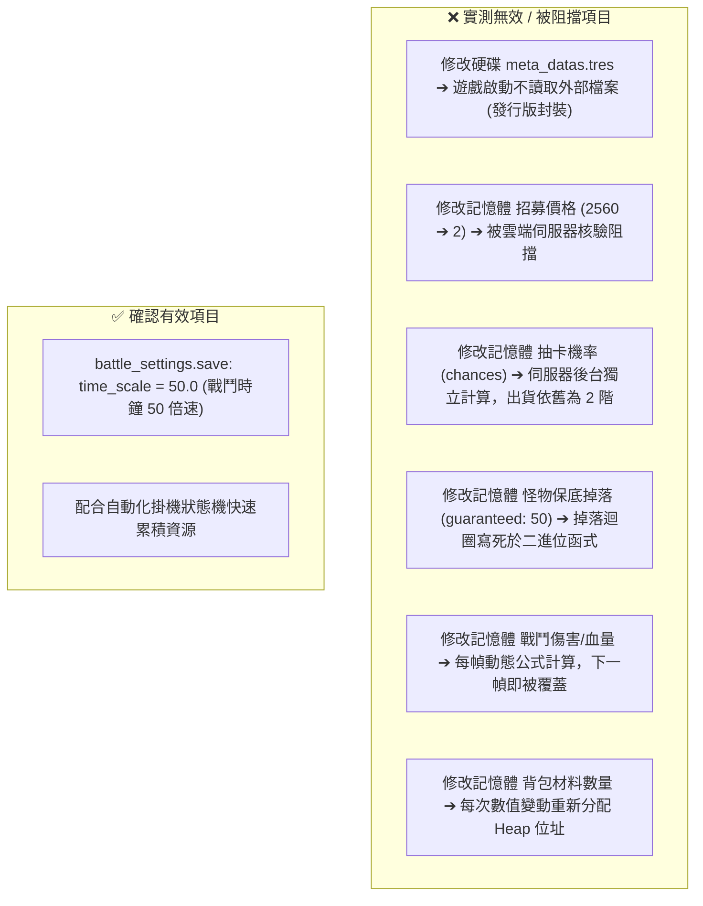

# 🛡️ Blackfire Crusade 遊戲數據與修改可行性實測評估報告

> 本報告基於對遊戲目錄 `D:\Steam\steamapps\common\Blackfire Crusade`、本機配置資料夾 `%APPDATA%\Godot\app_userdata\Blackfire Crusade`、Steam AppManifest (`AppID: 1765770`)、Godot 4.4 引擎日誌、以及 Cheat Engine 與 Python 記憶體/檔案注入之實測結果整理。

---

## 🧭 核心結論：可直接修改項目與限制

經二進位與動態記憶體實測，本遊戲具備「發行版資源封裝、雲端伺服器核驗、動態堆疊分配」三層架構限制。
修改靜態檔案或直接修改記憶體數值大多無法達到預期效果，目前唯一確認原生支援且能實質提升掛機效率的本機配置為 **`battle_settings.save` 之戰鬥倍速設定 (`time_scale`)**。



---

## 🔍 底層數據架構實測發現

### 1. 靜態資料庫 (`meta_datas.tres`) 為單向導出檔
* **實測現象**：修改遊戲目錄下的 `meta_datas.tres` 並加上唯讀鎖，遊戲啟動後數值未變更；Log 記錄 `ERROR: Cannot save file 'res://meta_datas.tres'`。
* **原因分析**：遊戲發行版（Release Template）已將預設字典封裝於 `Blackfire Crusade.exe` 內部。啟動時調用 `ResourceSaver.save()` 將內部資料輸出至硬碟快照，不讀取外部 `tres`；且發行版禁用了 `--extra-pack` 外部注入參數。

### 2. 鑽石與抽卡由伺服器端核驗
* **實測現象**：將酒館招募價格由 `2560` 改為 `2`，UI 顯示為 2 且按鈕可點擊，但按下後提示「鑽石不足」。
* **原因分析**：鑽石消耗與英雄招募由遠端伺服器進行權限核驗。伺服器僅認雲端資料庫之餘額，不接受客戶端傳遞之偽造價格。

### 3. 背包資料採用動態堆疊重新分配 (Heap Re-allocation)
* **實測現象**：在記憶體中連續搜尋材料數量變動（11 ➔ 12 ➔ 15），搜尋結果最終為空。
* **原因分析**：Godot 4 的字典結構在數值變更時會釋放原記憶體節點並重新申請新位址，導致靜態位址追蹤失效。

---

## 📊 實測項目與結果對照表

| 模組項目 | 修改方式 | 實測結果 | 原因分析 |
| :--- | :--- | :---: | :--- |
| **戰鬥倍速 (`time_scale`)** | 修改 `battle_settings.save` 為 `50.0` 並鎖定 | 🟢 **有效** | 遊戲原生支援由外向內讀取之本機存檔，戰鬥時鐘提升至 50 倍速。 |
| **酒館招募價格 (`epic_summon_price`)** | 記憶體將 `2560` 改為 `2` | 🔴 **無效** | UI 顯示變更，但扣款被遠端伺服器拒絕（伺服器端校驗）。 |
| **酒館抽卡機率 (`tavern.chances`)** | 記憶體將 5 星權重改為 `99999` | 🔴 **無效** | 出貨仍為 2 階，抽卡隨機數 (RNG) 由伺服器後台獨立計算。 |
| **Boss 保底掉落 (`guaranteed`)** | 記憶體將 `2.0` 改為 `50.0` | 🔴 **無效** | 記憶體數值已變更，但結算仍掉落 2 個，掉落上限寫死於二進位邏輯。 |
| **角色與技能傷害 (`damage_offset`)** | 記憶體修改傷害倍率 | 🔴 **無效** | 傷害由底層每幀動態公式計算，下一幀即被覆蓋。 |
| **鍛造材料配方 (`craft_items`)** | 記憶體將需求數量 `999` 改為 `1` | 🔴 **無效** | 前端 UI 顯示變更，但底層扣款函式執行二次校驗，提示材料不足。 |
| **背包材料數量 (精鐵錠/冰封錠)** | 記憶體搜尋動態數量 | 🔴 **無效** | 數值變更時，Godot 4 自動銷毀舊記憶體並重新分配新 Heap 位址。 |
| **硬碟靜態資料 (`meta_datas.tres`)** | 修改硬碟文字檔 | 🔴 **無效** | 發行版僅讀取 `.exe` 內部字節碼，硬碟檔案為導出快照。 |

---

## 🔮 未來可探究方向：`battle_settings.save` 的其他潛在設定

目前已確認 `battle_settings.save` 為遊戲原生開放載入的 JSON 存檔。後續可針對 Godot 戰鬥場景常見的設定欄位進行探究與測試：

1. **戰鬥自動化相關**：
   - `"auto_battle": true`：測試是否可在進入戰鬥時預設開啟自動攻擊與技能釋放。
   - `"skip_animation": true` / `"fast_forward": true`：測試是否支援跳過招式特寫或轉場動畫。
2. **渲染與效能優化相關**：
   - `"screen_shake": false`：測試是否能關閉暴擊震屏，降低長時間掛機之 GPU 負載並提高視覺比對穩定度。
   - `"damage_text": false`：測試是否能關閉傷害數字飄字，減少粒子運算開銷。
   - `"show_hp_bar": bool`：測試血條顯示模式。
3. **戰鬥結算與介面相關**：
   - `"auto_confirm_result": true`：測試是否支援戰鬥結束自動跳過結算畫面。

---

## 🛠️ 現階段建議方案

使用確認有效的 50 倍戰鬥倍速設定配合自動化腳本進行資源獲取：

```powershell
# 1. 套用 50 倍戰鬥時鐘設定 (免重開遊戲即時生效)
.\.venv\Scripts\python scripts/set_battle_settings.py --speed 50

# 2. 啟動自動化掛機狀態機
.\.venv\Scripts\python main.py --mode dungeon --backend
```