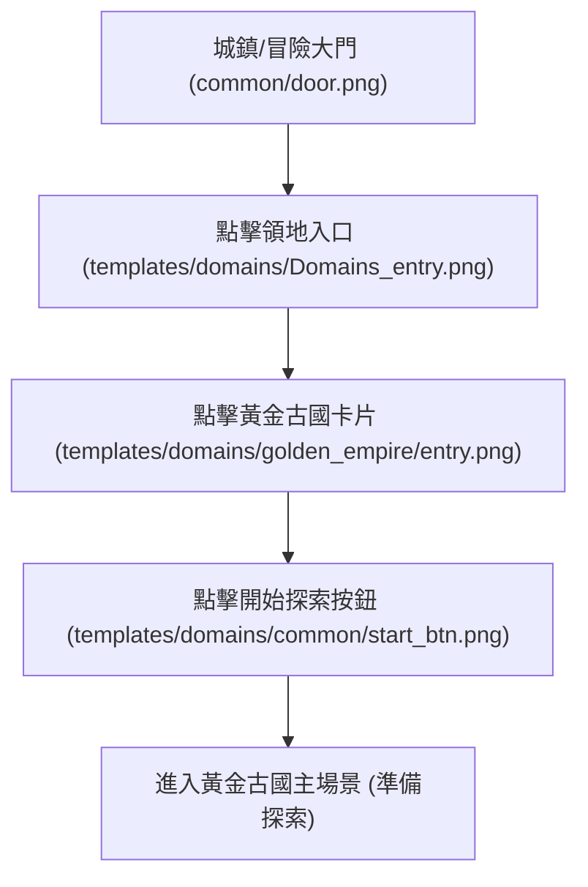

# 🏛️ 黃金古國 (Golden Empire) 領地自動化運行規格書

本文件定義領地系統（Domain 1：黃金古國）的導航路徑、探索迴圈、事件分支處理與異常退避機制。

---

## 🗺️ 一、導航進場流程 (Navigation & Entry)

進入黃金古國的順序路徑如下：



* **路徑模板清單**：
  1. `templates/domains/Domains_entry.png` (主入口)
  2. `templates/domains/golden_empire/entry.png` (古國卡片)
  3. `templates/domains/common/start_btn.png` (啟動按鈕)

---

## 🔄 二、核心探索迴圈與狀態機流程 (Explore Loop & State Machine)

進入古國場景後，主流程持續尋找並點擊 `templates/domains/golden_empire/explore_btn.png`（每次消耗 3 麵包）。點擊後依底層事件分為三大分支：

```mermaid
graph TD
    EXP["黃金古國主場景 (點擊 explore_btn.png)"] --> EVENT{"事件判定"}

    EVENT -->|戰鬥事件 (70% 怪 / 15% Boss)| BATTLE["⚔️ 進入戰鬥 (STATE_BATTLE)"]
    EVENT -->|寶藏事件 (15% 挖寶)| TREASURE["🎁 進入挖寶 (STATE_TREASURE)"]
    EVENT -->|麵包耗盡| NO_BREAD["🍞 體力不足退避"]

    %% 戰鬥分支
    BATTLE --> B_AUTO["自動戰鬥 (common/auto.png)"]
    B_AUTO --> B_WIN{"戰鬥勝負"}
    B_WIN -->|勝利| RESULT["🏆 結算子流程: 點擊 Continue * 2"]
    RESULT --> BAG_CHECK{"背包是否已滿?"}
    BAG_CHECK -->|是| BAG["🎒 轉移至 BACKPACK_FULL_SORTING"]
    BAG_CHECK -->|否| EXP
    BAG --> EXP
    B_WIN -->|戰敗| DEFEAT["💀 戰敗退回 Lobby ➔ 重新進場"]
    DEFEAT --> A

    %% 寶藏分支
    TREASURE --> T_CLICK["點擊免費寶物 (僅點 1 次免費，付費不點)"]
    T_CLICK --> T_CONFIRM["點擊確認 (common/confirm.png / ok.png)"]
    T_CONFIRM --> T_QUIT["點擊離開/返回 (common/quit.png)"]
    T_QUIT --> EXP
```

---

## 📦 三、各事件分支詳細處置規格

### 1. ⚔️ 戰鬥事件 (Battle Subflow)
* **戰鬥啟動**：辨識到 `common/auto.png` 確保自動戰鬥開啟。
* **結算處理**：
  * 戰鬥勝利後連續點擊 **2 次 Continue 按鈕**（`common/continue.png` / `common/continue_gray.png`）直到按鈕完全消失。
  * 檢查是否觸發背包滿（`backpack_full.png`），若滿則自動切換至裝備分選與清理流程。
  * 結算完畢後自動回到黃金古國主場景，繼續點擊 `explore_btn.png`。
* **戰敗處置**：
  * 若不幸戰敗（`defeat.png`），點擊放棄/返回退回大廳（Lobby）。
  * 狀態機轉移至 `NAVIGATING`，重新執行進場導航（`Domains_entry` ➔ `entry` ➔ `start_btn`）重新進入古國。

---

### 2. 🎁 古國寶藏事件 (Treasure Subflow)
* **特徵辨識**：辨識到挖寶畫面 (`templates/domains/find_treasure.png` 或 `templates/domains/treasure.png`)。
* **開箱決策**：
  * **僅點擊第 1 次免費開箱**。
  * 辨識出後續需消耗鑽石（20/40/80/100 鑽）的收費寶箱時**嚴格禁止點擊**。
* **收尾退出**：
  * 點擊確認獎勵（`common/confirm.png` / `common/ok.png`）。
  * 點擊退出按鈕（`common/quit.png`），返回古國主場景，繼續探索。

---

### 3. 🍞 麵包耗盡與退避 (Stamina Retreat)
* 當麵包不足 3 個無法繼續探索時，觸發麵包不足退避。
* 若配置啟用自動領麵包（`auto_bread`），導航至城鎮領取；若進入冷卻，則轉移至 `STATE_COLLECT_ONLY` 或等待排程。

---

## 📁 四、目前已收集模板資源對照表

| 模板相對路徑 | 用途說明 | 狀態 / 備註 |
| :--- | :--- | :--- |
| `templates/domains/Domains_entry.png` | 大廳領地總入口按鈕 | ✅ 已就緒 |
| `templates/domains/golden_empire/entry.png` | 第一領地：黃金古國選擇卡片 | ✅ 已就緒 |
| `templates/domains/common/start_btn.png` | 領地啟動/開始探索按鈕 | ✅ 已就緒 |
| `templates/domains/golden_empire/explore_btn.png` | 古國主場景探索按鈕 (消耗 3 麵包) | ✅ 已就緒 |
| `templates/domains/find_treasure.png` | 挖寶事件特徵圖 | ✅ 已就緒 |
| `templates/domains/treasure.png` | 寶物/寶箱特徵圖 | ✅ 已就緒 |
| `templates/domains/common/exit_to_lobby.png` | 領地返回大廳按鈕 | ✅ 已就緒 |
| `templates/common/continue.png` | 戰鬥結算繼續按鈕 (點擊 2 次) | ✅ 現有共用資源 |
| `templates/common/confirm.png` | 通用確認按鈕 (挖寶獎勵確認) | ✅ 現有共用資源 |
| `templates/common/quit.png` | 通用退出按鈕 (挖寶結束退出) | ✅ 現有共用資源 |
| `templates/backpack_full.png` | 背包滿全域攔截特徵 | ✅ 現有共用資源 |
| `templates/domains/golden_empire/exception/golden_king.png` | 古國 Boss「黃金君王」遭遇特徵 | ✅ 已就緒 |
| `templates/battle/setting.png` | 戰鬥中設定按鈕 (放棄選單) | ✅ 已就緒 |
| `templates/battle/giveup_battle.png` | 戰鬥中放棄挑戰按鈕 | ✅ 已就緒 |