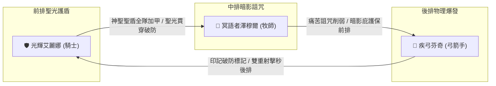

# ⚔️ 玩家當前隊伍全景資訊與 2800 戰力突破指南

> 本文檔依據遊戲原始數據 `meta_datas.tres`，全面解析玩家當前主力陣容（**🛡️ 光輝艾麗娜**、**🔮 冥語者澤穆爾**、**🏹 疾弓芬奇**）的確切技能數值、冷卻回合、SP 消耗、傷害倍率與附加效果，並給出精確的戰力突破策略。

---

## 📊 一、當前處境與客觀條件診斷

| 項目 | 當前狀態 | 系統機制與限制分析 |
| :--- | :--- | :--- |
| **主線進度目標** | 卡在【遺忘荒地 (Lv. 61~70)】門前 | 系統強制要求總戰力達到 **`2800`** 才能解鎖挑戰 |
| **英雄等級狀態** | **已達當前上限滿等** | 無法再透過經驗藥水提升基礎面板 |
| **英雄星級狀態** | **暫不消耗資源升星** | 全力積攢 **12,800 英雄幣** 準備在酒館直接購買 6.0 彩虹頂級英雄 |
| **城鎮血之祭壇** | **已完成血液獻祭** | 血之祭壇僅消耗血液，且底層不直接提供全隊面板戰力數值 |

---

## 🛡️ 二、當前主力三英雄精確技能與機制數據庫



---

### 1. 🛡️ 【前排核心】光輝艾麗娜 (騎士 / 聖騎士)

* **基本資料**：種族 `人類 (Human)` | 專精屬性 `神聖傷害加深 +10%, 神聖抗性 +10%, 生命值 +10%, 物理抗性 +10%`
* **每級成長**：雙端傷害 +1.0, **物理防禦 +5.0 (全職業第一)**, 魔法防禦 +1.0, 生命值 +5.0
* **推薦裝備**：長槍 (`spear`)、**重盾 (`shield`)**、重甲五件套 (`heavy_armor`)
* **確切配備技能列表**：

| 技能 ID | 技能名稱 | 類型 | 傷害屬性 | 傷害倍率 | CD | SP | 目標範圍 | 成長與附加效果明細 |
| :--- | :--- | :---: | :---: | :---: | :---: | :---: | :--- | :--- |
| `holy_strike` | **神聖打擊** | 主動 | 神聖傷害 | **120%** | 3 回合 | 0 | 敵方 遠程 1 體 | 眩暈觸發機率: 25%<br>每級傷害倍率: +2% |
| `sanctuary_light` | **聖所之光** | 主動 | 物理/輔助 | - | 5 回合 | -1 | 友方 遠程 1 體 | 堡壘護盾: 1~3 層<br>最大生命回復: 80 (每級+6)<br>最低生命回復: 40 (每級+3) |
| `divine_light_spear` | **聖光貫穿之槍** | 主動 | 神聖傷害 | **140%** | 5 回合 | -2 | 敵方 遠程 1 體 | 虛弱觸發機率: 25%<br>虛弱層數: 5~7 層<br>每級傷害倍率: +8% |
| `holy_aegis` | **神聖聖盾** | 主動 | 團隊輔助 | - | 15 回合 | -3 | 友方 全體 (全隊) | 全隊護甲提升: 60~100 (每級+6~10)<br>傷害激增層數: 1~2 層 |

---

### 2. 🔮 【中排核心】冥語者澤穆爾 (牧師 / 暗影神官)

* **基本資料**：種族 `骷髏 / 暗影魂裔` | 專精屬性 `治療效果提升 +10%, 神聖/暗影傷害加深 +20%, 神聖抗性 +10%`
* **種族天賦特質**：`bone_resilience`（**天生免疫流血 `bleed_immuned`**、物抗+20%、魔抗+20%）、`dark_affinity`（暗影傷害+50%、暗影抗性+200%）
* **每級成長**：雙端傷害 +1.0, 物理防禦 +1.0, **魔法防禦 +5.0**, 生命值 +5.0
* **推薦裝備**：權杖 (`scepter`)、魔導書 (`book`)、輕甲法袍 (`light_armor`)
* **確切配備技能列表**：

| 技能 ID | 技能名稱 | 類型 | 傷害屬性 | 傷害倍率 | CD | SP | 目標範圍 | 成長與附加效果明細 |
| :--- | :--- | :---: | :---: | :---: | :---: | :---: | :--- | :--- |
| `curse_agony` | **痛苦折磨詛咒** | 主動 | 暗影傷害 | **120%** | 5 回合 | -1 | 敵方 遠程 1 體 | 詛咒層數: 2~3 層<br>每級傷害倍率: +2% |
| `void_touch` | **虛空之觸** | 主動 | 暗影傷害 | **80%** | 3 回合 | 0 | 敵方 遠程 1 體 | 氣血封鎖層數: 2~3 層<br>每級傷害倍率: +2% |
| `dark_sanctuary` | **暗影庇護所** | 主動 | 防禦輔助 | - | 5 回合 | -2 | 友方 遠程 1 體 | 護甲加成係數: +20% (每級+1.5%)<br>暗影侵蝕層數: 3~6 層 |
| `mass_curse` | **群體詛咒** | 主動 | 暗影傷害 | **80%** | 7 回合 | -3 | 敵方 全體 (全隊) | 詛咒層數: 2~3 層<br>每級傷害倍率: +4% |

---

### 3. 🏹 【後排核心】疾弓芬奇 (弓箭手 / 遊俠)

* **基本資料**：種族 `人類 / 精靈` | 專精屬性 `暴擊率 +10%, 物理傷害加深 +20%, 物理抗性 +10%`
* **每級成長**：雙端傷害 +1.0, 物理防禦 +3.0, 魔法防禦 +3.0, 生命值 +5.0
* **推薦裝備**：長弓 (`bow`)、箭袋 (`quiver`)、中甲套裝 (`medium_armor`)
* **確切配備技能列表**：

| 技能 ID | 技能名稱 | 類型 | 傷害屬性 | 傷害倍率 | CD | SP | 目標範圍 | 成長與附加效果明細 |
| :--- | :--- | :---: | :---: | :---: | :---: | :---: | :--- | :--- |
| `double_shoot` | **雙重射擊** | 主動 | 物理傷害 | **65%** | 5 回合 | 0 | 敵方 遠程 2 體 | 流血觸發機率: 25%<br>流血層數上限: 3 層<br>流血基礎層數: 1 層<br>每級傷害倍率: +2% |
| `mark_shoot` | **印記射擊** | 主動 | 物理傷害 | **120%** | 3 回合 | 0 | 敵方 遠程 1 體 | 標記層數: 5 層 (大幅提升隊友對該目標之傷害)<br>每級傷害倍率: +4% |

---

## 🚀 三、零升級、零升星下突破 2800 戰力的唯一必勝路徑

在不能靠經驗升等、不消耗 12,800 英雄幣升星的前提下，**「裝備全槽位 100% 覆蓋」與「鐵匠鋪高階鍛造」是唯一能拉升 600~900 戰力的核心手段**：

### 1. 補齊 10 大裝備槽位（嚴禁空槽或佩戴低階白裝）
* **🛡️ 艾麗娜 (騎士)**：
  - **核心必備**：**紫色/金色重盾 (`shield`)**！盾牌在底層演算法中提供極高防禦評分加權 (`def: 1.0`)。
  - **防具**：頭盔、重胸甲、護手、板甲腰帶、鐵靴（重甲防禦係數高，戰力加分極大）。
* **🔮 澤穆爾 (牧師)**：
  - **武器與副手**：高階權杖 + 魔導書。
  - **飾品**：佩戴 2 枚【法強戒指】與【暗影護符】。
* **🏹 芬奇 (弓箭手)**：
  - **武器與副手**：4 階紫弓 + 暴擊箭袋。
  - **飾品**：佩戴 2 枚【暴擊之戒】與【狂暴項鍊】。

---

### 2. 利用 50 倍速戰鬥極速刷取鍛造材料
* 啟動戰鬥倍速工具：
  ```powershell
  .\.venv\Scripts\python meta_data/scripts/set_battle_settings.py --speed 50
  ```
* 前往主線第 5~6 關【冰凍峽谷 (`frozen_gorge`)】或地下城，自動掛機 2~3 分鐘。
* 取得精鐵錠 (`ingot_iron`)、黃金錠 (`ingot_gold`) 與寶石，至鐵匠鋪將全隊 3 人裝備升級為 **4 階史詩 (紫) 或 5 階傳說 (橘)**。

---

### 3. 戰力試算與預期

```text
【當前滿等基礎戰力】 ──► 約 2150 ~ 2300 (散裝/有空槽)
【全身 4~5 階紫橘裝】──► + 400 ~ 550 戰力
【填滿重盾與 3 飾品】──► + 250 ~ 350 戰力
────────────────────────────────────────
【最終面板戰力】    ──► 2850 ~ 3100 (零升星成功突破 2800 門檻！)
```

---

## 🎯 四、12,800 英雄幣存滿後的終極兌換規劃

當您掛機存滿 12,800 英雄幣後，酒館兌換優先級：
1. **首選：`hero_knight_askar` (聖騎士 阿斯卡)** ➔ 完美替換艾麗娜，自帶免疫沉默、高額全抗性與 200% 神聖裁決。
2. **次選：`hero_archer_drugor` (遊俠 德魯戈)** ➔ 替換芬奇，具備爆血處決與無限血怒連動。
